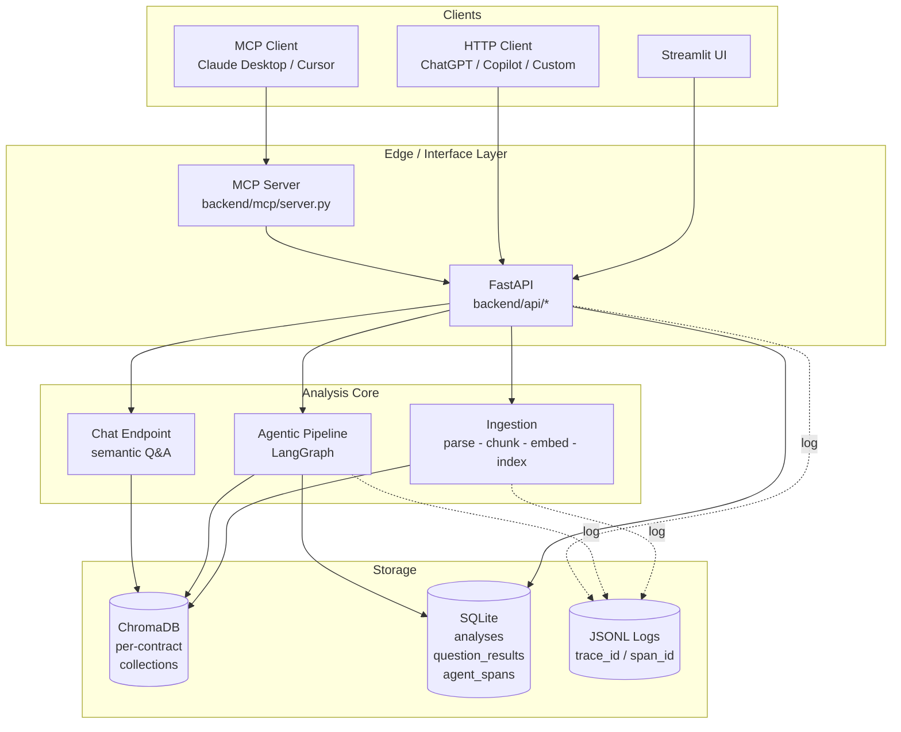
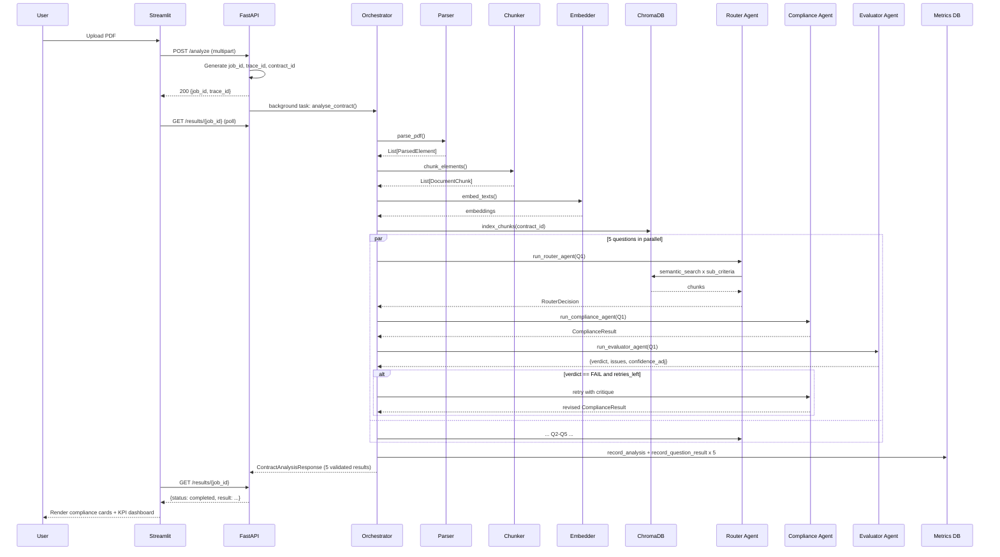
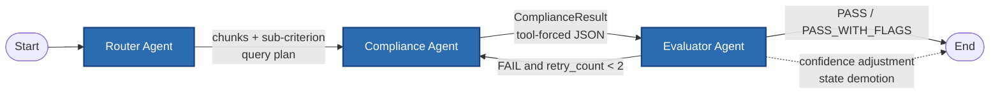
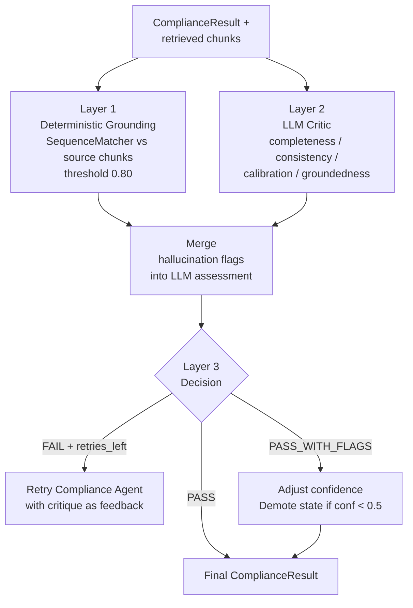
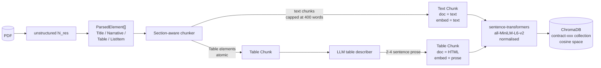
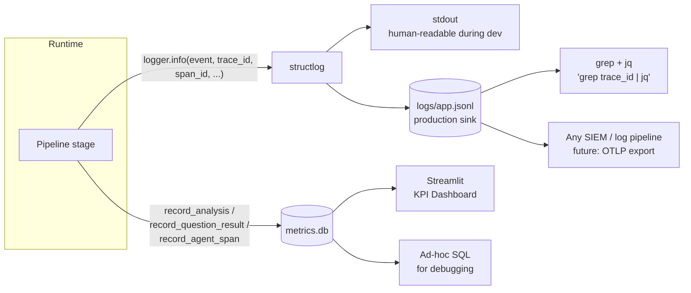
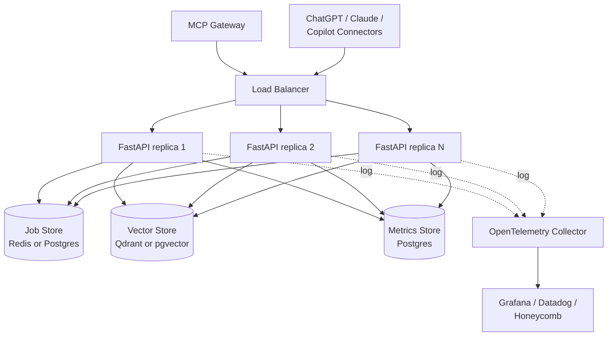

# Architecture

Diagrams and data-flow for the Contract Analyzer. Read together with
`DESIGN.md` (rationale) and `MCP_CONNECTOR.md` (external integrations).

---

## 1. System overview

---

## 2. Request flow — PDF upload to JSON result

---

## 3. Per-question agent graph (LangGraph)

Evaluator internals:

---

## 4. Data flow — PDF elements to chunks to vectors

Why the split between `document` and `embedding_text` on table chunks:
- The **document** returned to the compliance agent must preserve structure —
  HTML keeps rows and columns intact so the agent can quote a specific cell.
- The **embedding text** drives retrieval — prose aligns with how analysts
  phrase queries, so the vector lives near natural-language queries.

---

## 5. Observability architecture

Every log event and every metric row carries the same `trace_id`, so a single
request is reconstructable across both sinks.

---

## 6. Deployment topology (production extension)

The in-process components migrated in this topology:
- `_jobs` dict → shared job store (Redis / Postgres)
- ChromaDB → Qdrant / pgvector (multi-replica safe)
- SQLite metrics → Postgres (aggregates across replicas)
- File-based JSONL → OTLP → unified observability stack

No application code changes beyond the I/O shims — the agent graph and
compliance logic are unchanged.
