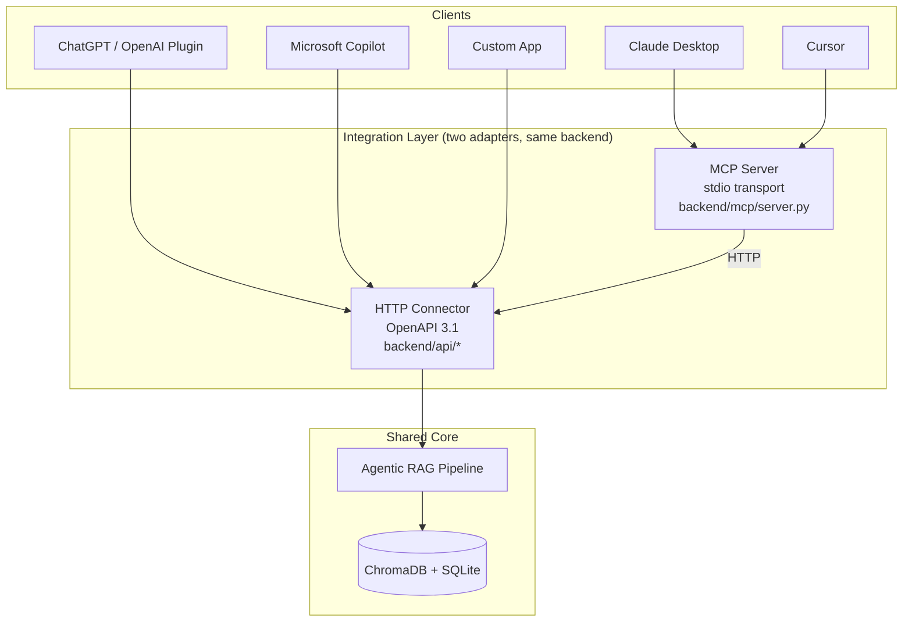

# MCP Server and External Connector Design

This document covers the extensibility layer required by assignment §3.3:
how the Contract Analyzer can be ported or exposed as (a) an external
connector invokable by third-party chat apps and (b) an MCP server
consumable by any MCP-compatible client.

Read together with `ARCHITECTURE.md` for diagrams and `DESIGN.md` for the
core pipeline rationale.

---

## 1. Two integration modes, one backend

Both integration modes reuse the same FastAPI backend and the same
compliance pipeline. Nothing in the core analysis logic depends on how the
request arrived.



The MCP server is a **thin adapter** that translates MCP tool calls into
HTTP requests against the FastAPI backend. This keeps the analysis logic
in exactly one place and lets the connector and MCP surface the same
capabilities without duplication.

---

## 2. MCP server — design

### 2.1 Transport and framing

- **Transport.** stdio. Launched as a subprocess by the host client (Claude
  Desktop / Cursor) and communicated with over JSON-RPC on stdin/stdout.
- **Protocol.** MCP 1.x (`mcp>=1.2.0` Python SDK).
- **Entry point.** `python -m backend.mcp.server`.

Stdio is the right default for local desktop clients. For remote or
multi-tenant deployments, swap to the WebSocket/SSE transports offered by
the same SDK without changing the tool implementations.

### 2.2 Tool surface

| Tool | Purpose | Inputs | Returns |
|------|---------|--------|---------|
| `analyze_contract` | Upload a PDF and start compliance analysis | `pdf_base64`, `filename` | `{job_id, trace_id, contract_id, status}` |
| `get_analysis_results` | Poll for status / final result of an analysis | `job_id` | `{status, progress_pct, result?}` |
| `query_contract` | Free-form Q&A over an already-analysed contract | `contract_id`, `question` | `{reply, sources}` |

Each tool schema is defined inline in `backend/mcp/server.py` and advertised
via the MCP `tools/list` capability.

### 2.3 Authentication

- **Local deployment (current).** No authentication. Stdio implies the host
  process already trusts the server subprocess it launched, so there is no
  network attack surface. The `ANTHROPIC_API_KEY` is injected from the host's
  MCP config.
- **Remote deployment (future).** When exposing over WebSocket/SSE, the
  recommended approach is a per-client bearer token passed in the MCP
  initialisation metadata, verified by a tiny middleware. The tool
  implementations themselves remain unchanged.

### 2.4 State management

- **Stateless tools.** Each tool call is independent.
- **Shared state via `contract_id`.** Analysis populates a contract-scoped
  ChromaDB collection and a metrics row; subsequent calls
  (`get_analysis_results`, `query_contract`) reference the same
  `contract_id` to retrieve persisted state.
- **No per-session state.** The host client (Claude Desktop / Cursor) keeps
  conversation history; the MCP server does not. Sessions are re-established
  cheaply on every launch.

### 2.5 Multi-turn interactions

The server is stateless, so multi-turn follow-up works as follows:

1. The host first calls `analyze_contract` → receives `contract_id`.
2. The host stores `contract_id` in its own conversation state.
3. On every follow-up, the host calls `query_contract(contract_id, question)`.
4. The server retrieves from the per-contract vector store and returns a
   grounded answer with sources.

For multi-turn that requires the model to see prior exchanges, the host is
responsible for carrying chat history. The underlying `/chat` endpoint
accepts an optional `history` array so the LLM sees context; the MCP
`query_contract` tool currently sends an empty history and can be extended
to accept it as a parameter in a backwards-compatible way.

### 2.6 Failure and retry

- **Tool errors** return a `TextContent` block describing the failure rather
  than throwing. This lets the host render a graceful message instead of
  silently failing.
- **Long-running analysis.** `analyze_contract` returns `job_id` immediately
  (the API is async-by-default). The host polls via `get_analysis_results`.
  Polling cadence is a host decision — 2–5 seconds is typical.
- **Retries.** The MCP SDK itself does not retry; the host is expected to
  handle transient failures. The backend's own retry logic (evaluator retry,
  LLM transient errors) is unaffected.

### 2.7 Example host configuration (Claude Desktop)

```json
{
  "mcpServers": {
    "contract-analyzer": {
      "command": "python",
      "args": ["-m", "backend.mcp.server"],
      "cwd": "/path/to/contract_analyzer",
      "env": {
        "ANTHROPIC_API_KEY": "sk-ant-...",
        "API_BASE_URL": "http://localhost:8000/api/v1"
      }
    }
  }
}
```

Cursor uses an equivalent JSON format. No code change is required per host.

---

## 3. External connector — design (OpenAPI)

### 3.1 Why FastAPI auto-OpenAPI is the connector

FastAPI generates an OpenAPI 3.1 spec from the Pydantic request/response
models that already back the endpoints. That spec is the connector
specification; chat apps that accept OpenAPI plugins (ChatGPT Actions,
Microsoft Copilot Connectors) consume it directly.

- **Live spec.** `GET /openapi.json` on the running API.
- **Interactive docs.** `GET /docs` (Swagger UI) and `GET /redoc`.
- **Snapshot for review.** A static copy of the spec can be committed at
  `docs/openapi.json` (run `curl http://localhost:8000/openapi.json > docs/openapi.json`).

### 3.2 Endpoints surfaced

| Method | Path | Purpose |
|--------|------|---------|
| `POST` | `/api/v1/analyze` | Upload PDF, start analysis, return `job_id` |
| `GET` | `/api/v1/results/{job_id}` | Poll for status and final result |
| `GET` | `/api/v1/jobs` | List recent jobs |
| `POST` | `/api/v1/chat` | Free-form Q&A over an analysed contract |
| `GET` | `/api/v1/metrics/summary` | KPI cards (for embedded dashboards) |
| `GET` | `/api/v1/metrics/history` | Historical trend data |
| `DELETE` | `/api/v1/contracts/{contract_id}` | Purge a contract's vectors |
| `GET` | `/health` | Liveness probe |

### 3.3 Authentication model

Production deployments should layer one of the following in front of the
FastAPI app; current development mode runs without auth to simplify the
demo.

| Model | When | How |
|-------|------|-----|
| API key | Single-tenant trusted clients | `Authorization: Bearer <key>` header, verified in a FastAPI dependency |
| OAuth 2.0 client credentials | Multi-tenant SaaS / ChatGPT Actions | Standard OAuth flow; the connector spec declares the authorization URL |
| mTLS | Internal service-to-service | Cert chain enforced at the ingress layer |

The OpenAPI spec already includes a `securitySchemes` slot; switching modes
is a config change, not a code rewrite.

### 3.4 Request / response contracts

All request and response bodies are declared as Pydantic v2 models in
`backend/compliance/schemas.py`. The OpenAPI spec derives its JSON Schema
definitions from those models, so the wire contract is guaranteed to match
what the backend validates at runtime.

Key contracts:

- `ContractAnalysisResponse` — the full analysis result, 5
  `ComplianceResult` items plus `ProcessingMetadata`.
- `ComplianceResult` — `{compliance_state, confidence, relevant_quotes,
  rationale, sub_criteria_results, evaluator_assessment, retry_count}`.
- `ChatRequest` / `ChatResponse` — free-form Q&A with history and sources.

### 3.5 State and multi-turn

- **Stateless by default.** Every endpoint is stateless; the only shared
  state is the per-contract ChromaDB collection and the metrics table.
- **Multi-turn chat.** `POST /chat` accepts a `history` array of
  `{role, content}` messages. The server appends the most recent 6 turns to
  the LLM prompt. The client owns the conversation; the server is
  stateless.
- **Long-running analysis.** The async job pattern (`analyze` returns
  `job_id`, client polls `/results/{job_id}`) is the standard integration
  shape for chat apps that cannot block the user for ~20–60 seconds of
  ingestion plus parallel agent calls.

### 3.6 Rate limiting and cost control

Not implemented in the take-home scope. Production should add:
- **Per-key rate limits** (requests per minute) at the ingress layer.
- **Per-key token budget** enforced by reading `estimated_cost_usd` from the
  metrics table and short-circuiting when exceeded.
- **Payload size cap** on `/analyze` to bound ingestion cost.

### 3.7 Deployment notes

The FastAPI app runs cleanly under `uvicorn` with `--workers N` or behind
any ASGI process manager. The two production changes required before
multi-replica deployment:

1. Externalise the `_jobs` dict (Redis / Postgres).
2. Externalise the ChromaDB persist path (Qdrant / pgvector) so all
   replicas see the same vector store.

Both are described as extension paths in `DESIGN.md §4.4`.

---

## 4. Design rationale summary

| Decision | Rationale |
|----------|-----------|
| Two adapters, one backend | No duplication of analysis logic; adapters are thin translators |
| MCP server uses stdio | Matches how Claude Desktop / Cursor launch tools; zero network exposure |
| Tools are stateless, keyed by `contract_id` | Simpler protocol; state lives in storage, not in the adapter |
| OpenAPI derived from Pydantic | Single source of truth for wire contract |
| Auth is opt-in and layered, not baked in | Allows the same code to serve local dev, internal-only, and public SaaS with only config changes |
| Long-running analysis uses a polled job pattern | Honest about the fact that ingestion + 5 parallel agent loops cannot be sub-second; chat hosts handle polling well |
| Retry / failure handling at the adapter boundary | Tool errors return human-readable content; backend keeps its own retry loop for model-level failures |
